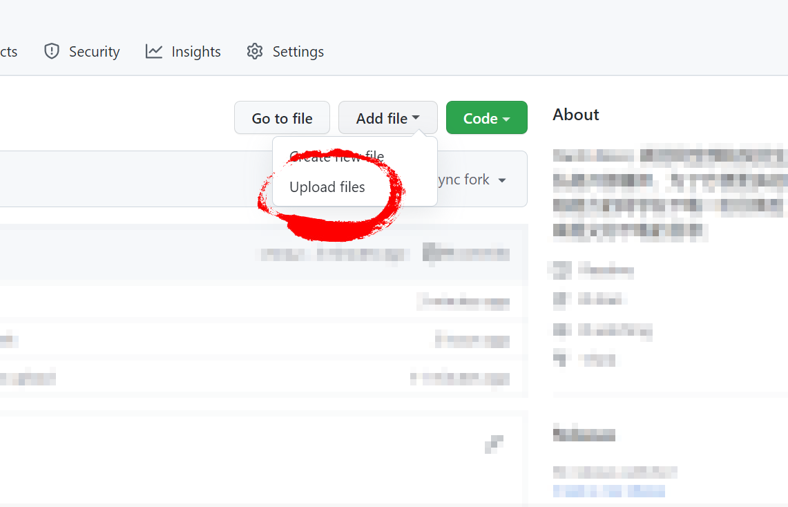
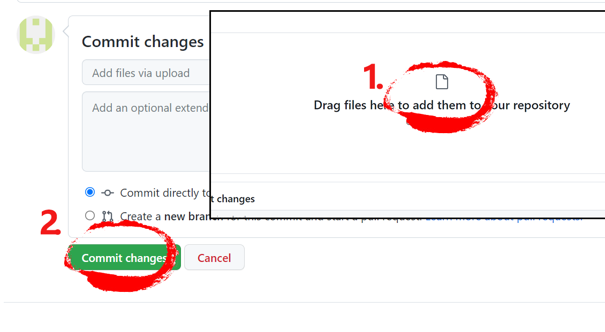
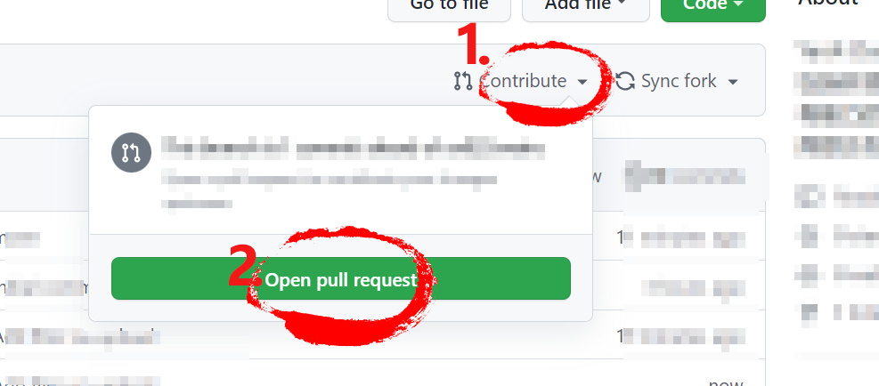

# YanX-Docs
YanX-Docs; 这是一个公开库，为了方便更多的同学，请同学在下载一份目录后，向本仓库提交你下载的目录；

## 搜索文件

[🔗去搜索](https://github.com/xx025/YanX-Docs/find/main)

### 此仓库贡献者
>由于仓库变更原因全部贡献者未能列出
<!-- readme: collaborators,contributors -start -->
<table>
<tr>
    <td align="center">
        <a href="https://github.com/xx025">
            
             
            <b>Rycbar123</b>
        </a>
    </td>
    <td align="center">
        <a href="https://github.com/Yuyyts">
            
             
            <b>Yuyyts</b>
        </a>
    </td></tr>
</table>
<!-- readme: collaborators,contributors -end -->

## 提交步骤

### 1. 登录你的github账号，fork 本仓库

### 2. 添加文件到你fork 的分支

1. 选择上传文件

2. 上传自己的文件并提交

### 3. 创建被拉取请求

### 4. 大功告成！感谢你的付出！
